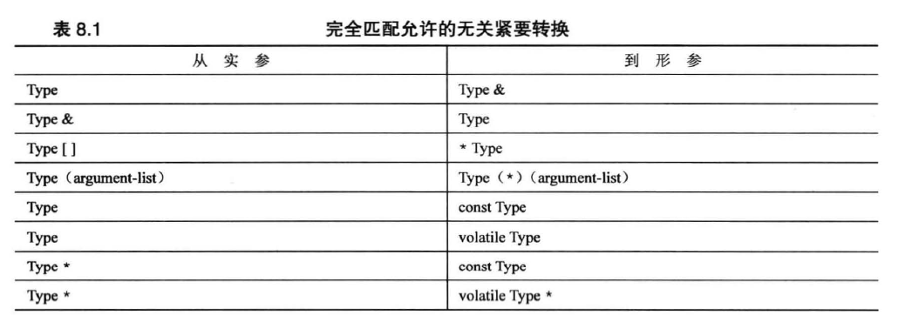

# C++ Primer 第六版学习笔记

记录重点难点，易忘、混淆点。

任务1. c++primer保持一天一个章节，加课后习题
任务2. 刷题一天两道，配合学过的c++primer容器和算法去刷够50道开始看labuladong的算法小抄

总计18章节计划5.10号前搞定任务一。

## Day1-2024/4/26：0-Chapter2-end

## Chapter2

tips：在大型项目中不写 using namespace std 二十using std::cin using std::cout以定向定义某些函数的空间，而不是直接定义所有，防止出现歧义。

## Chapter3

C++内置的整形-unsigned long 、long、unsigned int、int、unsigned short、short、unsigned char、signed char、bool

C++11新增：unsigned long long 和 long long

表示各种整形的系统限制的 climits 文件

表示各种整型的数字字面值（常量）

使用const限定符来创建符号常量。

浮点：float\double\long double

表示各种浮点类型的系统限制的cfloat 文件

各种浮雕类型的数字字面值

自动类型转换 强制类型转换

### 简单变量

short 至少16

int 至少与short 一样长

long至少32位，且至少与int一样长

long long 至少64位，且至少与long一样长

#### 特殊控制符

dec\hex\oct 分别指示cout 十进制、十六进制、八进制显示正数

cout<<hex;\\\此后的打印均改变。

cout<<int_n;

## Chapter4数组

char   chararray[];//  char字符串可直接cout打印，如果未满自动补\0,\0也是string的输出终止条件。

### 注意

'S'是83的另一种写法，但是“S"字符串的写法则代表S和\0组成的字符串，因此用常量不相等，单引号和双引号不能互通。而且”S“ 实际上表示的是字符串所在的内存地址。因此

```cpp
char shirt_size = "S";  //非法的
```

这试图将一个内存地址赋值给shirt_size;

### 指针和自由存储空间

int *pt = new int;//自我理解为类似匿名变量，即没有直接表示该数据的变量名称，但是又确实存在这样一块变量地址，唯一访问方法为指针pt访问。

注意: 正常变量的值都被存在栈的内存区域中，而new 从被成为堆或自由存储区的内存区域分配内存。

```cpp
int *ps = new int;
...
delete ps;//释放内存
delete ps;//不被允许，因为已经释放。
int jugs = 5;
int *pi = &jugs;
delete pi;//不被允许 地址不是new分配的内存。
```

这样会释放ps指向的内存，但是不会删除指针ps本身。

#### 使用new来创建动态数组

如果直接声明创建数组，则在被编译时将分配内存空间。此时为静态联遍 static binding。而使用new时，则在运行阶段创建它。这被成为动态联编。dynamic binding。

1. 不要使用delete 来释放不是new分配的内存
2. 不要是哟个delete释放同一块内存两次。
3. 如果用new[] 分配数组则用delete[] 释放
4. 如果使用new[] 为一个实体分配，则应用delete 来释放
5. 对空指针 nullptr 应用delete 是安全的。

```cpp
double *p3 =new double [3];
p3[0] = 0.2;
p3[1] = 0.3;
p3[2] = 0.5;
//指针可以当作数组来访问每个元素。
p3 = p3+1;//不同的是可以改变指针变量指向的第一个值。
//现在p3[0]  = 0.3;
```

### 指针不同于实体的关键点

实体对象利用 . 来实现数据和函数的调用，而指向实体的指针可以用->直接访问实体的数据和函数。//自我理解，重载运算符，类似 (*p).函数/变量

### string 和 char[]类型的 I/O

char [] -> 可以用 cin.getline(c,n);//c代表char * ,n代表长度。

string str;// getline(cin,str);   //读取整行，正常的cin读取到 空格或者换行符停止。

## Chapter5循环语句

"++ * 的关系"

++运算符级别较高

++*pt是先取值后加加

但是**p*++和*++pt都是先自加再取值

关系运算符的优先级不如算数运算符

x+3<y+3     //相当于 (x+3)<(y+3)

c风格字符串不能用来 ==，因为其表示的是一个地址，只会比较是否地址相同，应该用strcmp(str1,str2);  str1 == str2 时返回 0 否则 > 给 +0

string对象可以用来 == != 因为string类重载了这些运算符。

逗号表达式   ，  逗号的运算等级最低:  int a = 1,2;相当于  int a = 1 ;2 在后面被舍弃。int a = (1,2); 这种情况使用右值， 即 int a =2 ;

## Chapter if条件逻辑语句

&& 和 ||  低于算数运算符，因此一般判断条件不需要加上括号既可以。但是！的优先级优于算数运算符和逻辑运算符，在对表达式取反时要加上括号。

### 字符函数库cctype

继承至ctype.h。 isalpha(ch),如果ch是一个字符 返回一个int类型的非零数。同样如果ch是一个,句号等标点符号，则ispunct(ch)则返回一个非零值。

```cpp

#include<cctype>
char ch;
if('a'<=ch&&ch<='z'||'A'<=ch&&ch<='Z')   =>  if(isalpha(ch))
isdigits()=》是否为一个数字
isspace 是否为一个空格
```

本章节的课后题未作。//记得补上

## Chapter7

函数相关 int add(int * a,int * b);//声明函数，指针形式传递地址，数组同样可以传递指针，也可以传递 int a[].使用方式相同。

函数指针 int (*pf) (int a,int b)；声明一个int返回值，两个int参数的函数指针pf。函数的地址为函数名. pf = funname;   (*pf)(a,b);

typedef int (*pf)(int a,int b);声明一个pf函数指针类型。 pf a; a即为一个pf类型的函数指针。

## Chapter8函数探幽

int & value = a;  value 同 a的值和地址一样。即value是a的别名

### 尽可能使用const

使用const可以避免无意中修改数据的编程错误

使用const使函数能偶处理const和非const实参，否则将只能接受非const数据

使用const引用使函数能够正确生成并使用临时变量。

应尽可能将引用行参声明为const。

### 右值引用

&&声明，即： int && a = 3；

### 引用细节

函数内部临时变量不能作为引用返回，会报错。//5.3第八章没学完。后续补

### 函数重载

同命名方法，但是不同参数列表。在一个命名只有一个函数时，函数调用会强制转换类型，使参数类型强制转换。但是重载实现后，参数不匹配时，程序将拒绝调用函数。

非const可以默认转换const 但是const不能作为参数传递给非const参数。

如果重载const 和 普通类型，编译器会根据参数是否是const进行调用。

C++不允许相同参数不同返回值的重载。必须不同参。

当传递"string"时，这种类型为char *，但是由于为右值，因此参数为const char * 才可以被匹配。如果没有const char * 可以被强制转为string也可以。

实现重载的底层是编译器会对函数进行名称修饰或者名称矫正

long myfunction(int a,double b); 会被转化为内部不同的接口表示 ?myfunction@@YAXH

### tamplate函数模板

tamplate `<typename/class T>//typename 和 class二选一，class属于新增标准，但是typename仍然可用,T为自定义类型。名字可以更改。`

```cpp
//示例函数  模板加函数重载
tamplate <typename T>
void testTemplate(T t);
tamplate<typename T>
void testTemplate(T t[],int n);
//显示具体化模板
struct job{
	int a;
	int b;
	string name;
}
void view_Template(job a); //非模板函数
template<class T>
void view_Template(T a);//模板函数
template<> void view_Template<job>(job a);//具体化
//调用优先级为 非模板 > 具体化 >模板函数
```

注意模板并非函数定义，在调用时候才会根据参数生成一个函数实例。（编译器使用模板为特定类型生成函数定义时，得到的是模板实例）

显示实例化： template void fun `<int>(int &a);`

隐示实例化：声明模板后的调用会实例化一个相应的函数。

加上上述的具体化三者统称为具体化。三者表示的都是使用具体类型的函数定义，而不是通用描述。前缀template 和 template<>区分具体化和显示实例化。

这会直接实例化一个函数，（也叫一个函数定义）。

显示具体化也会直接实例化。

auto和decltype的使用

template `<class T1,class T2>`

```cpp
auto gt(T1 x,T2y)->decltype(x+y)
{
	... 
	return x + y;
}
```

//auto 是一个占位符，由于返回类型不能确定，例如t1是int t2是float，因此decltype关键字可以检测后面表达式或者变量的类型。结合auto可以实现可适应返回类型。指针和引用可以被const和非const重载，但是如果出现两个其他的完全匹配函数则会出现二义性，出现报错。



2024.5/4结束

## Chapter9内存模型和命名空间

动态存储：函数内部声明变量

连接性

外部链接，内部链接。

静态存储类型有3种：

外部链接：函数外声明

其他文件使用 extern关键词进行引用。

file1:int cats; file2:extern int cats; //否则无法使用同命名数据

内部链接：函数外static声明

无连接：函数内static声明

三种均是静态存储，即函数周期结束存储依旧存在，等同文件周期周期

const 变量相当于static 声明，函数为内链接。如果要实现外链接，则需要在所有的文件中都加入extern

### 命名空间

namespace 解决函数冲突问题。方便代码管理使用。

namespace myspace{

}

未命名空间

namespace

{

int counts//相当于在所属文件中的 static int counts  即静态存储 内部链接。

}

在练习题中，其他文件使用namespace 中的函数重载时。需要加上namespace::fun这样才可以使用命名空间中的函数定义。

### using声明和using编译

using namespace std 为编译，使用所有std空间中的变量和声明。

using std：：cin   为声明，在当前作用域使用单个声明。

## Chapter10类

### 什么是类

类是用户定义的类型的定义。类似声明指定了数据将如何存储，同时指定了用来访问和操纵这些数据的方法（类成员函数）。

构造函数:构造函数只会在用户没有定义时提供默认构造函数，如果已经提供则系统不会提供默认构造。

class A ;A a; a = A()。类似这样的赋值，a已经存在，再利用构造函数赋值的时候，会生成一个临时对象，然后进行赋值，之后会调用析构函数删除该临时对象。

同样，C++允许类和结构一样进行A = B赋值。（同类或同结构）。

类作用域内枚举。 enum class {}

作用域内的枚举，由于提升了类型安全，不能隐式转换整形

在类内

```cpp
class{
	enum class eggclass{ming,middleg,maxg};
	int d = int(eggclass::middleg);//不能隐式转化。
	int f = middleg;//可以//使用的是类外的普通枚举
}
enum egg{ming,middleg,maxg};//类内外都有ming的枚举类型，但是加上了class会使得eggclass的作用域在类内，并且由于类型安全不会隐式转换int型。
```

## Chapter11使用类

### 运算符重载

Time operator +(const Time & t) const;

Time operator*(double n) const;  //都是使用临时对象进行加减乘除，因此使用const限定不改变对象数据。

### 友元

友元函数；友元类；友元成员函数；

```cpp
//创建友元
class Time
{
...
public:
	friend Time operator* (double n,const Time& t);//权限与成员函数相同，但是不能使用成员函数的方式访问。且定义不需要friend关键字。
}
```

提示：如果要为类重载运算符，并将非类的项作为其第一个操作符，则可以用友元函数来反转操作数的顺序。

友元的调用：A = n*B  =》 A = operator *(n,B);

常用 << 重载运算符

```
ostream & operator<<(ostream & os,const Time &t)
{
os<<t.hours<<"hours, "<<timinutes
<<" minutes";
return os;
}
```

之后就可以这样打印类 Time : cout<< t; 因为 hours 和minutes是私有的，因此需要将其设置Time的友元函数。

对于重载运算符，优先使用成员函数，其次再用友元。

### 类的自动转换和强制转换

如果一个类的构造函数只有一个参数，那么 = 可以将等式右边的值隐士转换为对象的值。即使用构造函数构造一个临时对象并且赋值给它。

```cpp
class stone{
int weight;
public:
	stone(int nvalue){weight = nvalue;}
}
stone A;
A = 3;//临时构造一个int为3的stone对象，然后赋值给A；
explicit 如果夹在stone构造前，就可以关闭这种特性。
使其只可以显示转换，不能隐式转换。//只有一个参数或者后面参数有默认值才可以隐式转换。
```

## 类和动态内存分配

12.1.2特殊成员函数

1. 默认构造函数，如果没有定义构造函数
2. 默认析构函数，如果没有定义
3. 复制构造函数，如果没有定义
4. 赋值运算符，如果没有定义；
5. 地址运算符，如果没有定义

复制构造函数：将一个对象复制到新创建的对象。也用于按值传递参数。StringBad(const String &s)//复制构造函数的默认形式。默认总是出现浅复制。如果有new的对象则可能会出现两个对象指向同内存空间，导致析构出错。

//在实际使用中，所有初始化赋值的对象都调用的是复制构造函数。只有在初始化之后的 = 运算符才是赋值构造函数。

赋值运算符：使用=的时候就有可能调用赋值运算符。

重载： StringBad & StringBad::operator=(const StringBad & st);

在类中使用new构造时要统一new的使用，并且定义复制构造函数、定义赋值运算符。使得其进行深复制，而不是只复制指针地址。

## Chapter13类继承

### 虚函数 virtual

C++默认编译为静态联编。如果类不会用作基类，则不需要动态联编，同样，如果派生类不重新定义基类的任何方法，也不需要使用动态联编。静态的效率更高。

C++指导原则之一：不要为不使用的特性付出代价（内存或者处理时间）。

通常编译器处理虚函数的方法是：给每个对象添加一个隐藏成员。隐藏成员中报存了一个指向函数地址数组的指针。这种数组被成为虚函数表。表中存储了为类对象进行声明的虚函数的地址。

友元：在派生类函数中的同名友元中，强制转换为基类，在用基类的运算符。
