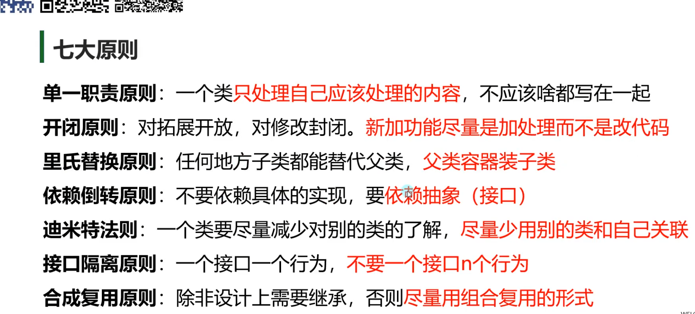

# H1面向对象原则

封装继承多态

七大原则

开闭原则、依赖倒转原则、里氏替换原则、单一职责原则、接口隔离原则、合成复用原则、迪米特法则

# C#重点语法

## 基础语句

```C#
Console.WriteLine("Hello World!");
Console.Write();//仅打印后无换行
//区分大小写并且打印string 要用双引号
```

* public：所有对象都可以访问；
* private：对象本身在对象内部可以访问；
* protected：只有该类对象及其子类对象可以访问
* internal：同一个程序集的对象可以访问；
* protected internal：访问限于当前程序集或派生自包含类的类型。

#### C# while 判断()

while(n--) 非法 必须使用 while(n--!=0)

## 代码：结构体和类的区别

```C#
using System;

namespace Lesson25_面向对象相关_结构体和类的区别
{
    class Program
    {
        static void Main(string[] args)
        {
            Console.WriteLine("结构体和类的区别");

            #region 区别概述
            //结构体和类最大的区别是在存储空间上的，因为结构体是值，类是引用，
            //因此他们的存储位置一个在栈上，一个在堆上，
            //通过之前知识点的学习，我相信你能够从此处看出他们在使用的区别——值和引用对象在赋值时的区别。

            //结构体和类在使用上很类似，结构体甚至可以用面向对象的思想来形容一类对象。
            //结构体具备着面向对象思想中封装的特性，但是它不具备继承和多态的特性，因此大大减少了它的使用频率。
            //由于结构体不具备继承的特性，所以它不能够使用protected保护访问修饰符。
            #endregion

            #region 细节区别
            //1.结构体是值类型，类是引用类型
            //2.结构体存在栈中，类存在堆中
            //3.结构体成员不能使用protected访问修饰符，而类可以
            //4.结构体成员变量申明不能指定初始值，而类可以
            //5.结构体不能申明无参的构造函数，而类可以
            //6.结构体申明有参构造函数后，无参构造不会被顶掉
            //7.结构体不能申明析构函数，而类可以
            //8.结构体不能被继承，而类可以
            //9.结构体需要在构造函数中初始化所有成员变量，而类随意
            //10.结构体不能被静态static修饰（不存在静态结构体），而类可以
            //11.结构体不能在自己内部申明和自已一样的结构体变量，而类可以
            #endregion

            #region 结构体的特别之处
            //结构体可以继承 接口 因为接口是行为的抽象
            #endregion

            #region 如何选择结构体和类
            //1.想要用继承和多态时，直接淘汰结构体，比如玩家、怪物等等
            //2.对象是数据集合时，优先考虑结构体，比如位置、坐标等等
            //3.从值类型和引用类型赋值时的区别上去考虑，比如经常被赋值传递的对象，并且
            //改变赋值对象，原对象不想跟着变化时，就用结构体。比如坐标、向量、旋转等等
            #endregion
        }
    }
}

```

```C#
using System;

namespace Lesson26_面向对象相关_抽象类和接口的区别
{
    class Program
    {
        static void Main(string[] args)
        {
            Console.WriteLine("抽象类和接口的区别");

            #region 知识回顾
            //抽象类和抽象方法
            //abstract修饰的类和方法
            //抽象类 不能实例化
            //抽象方法只能在抽象类中申明 是个纯虚方法 必须在子类中实现

            //接口
            //interface 自定义类型
            //是行为的抽象
            //不包含成员变量
            //仅包含方法、属性、索引器、事件，成员都不能实现，建议不写访问修饰符，默认public
            #endregion

            #region 知识点一 相同点
            //1.都可以被继承
            //2.都不能直接实例化
            //3.都可以包含方法申明
            //4.子类必须实现未实现的方法
            //5.都遵循里氏替换原则
            #endregion

            #region 知识点二 区别
            //1.抽象类中可以有构造函数；接口中不能
            //2.抽象类只能被单一继承；接口可以被继承多个
            //3.抽象类中可以有成员变量；接口中不能
            //4.抽象类中可以申明成员方法，虚方法，抽象方法，静态方法；接口中只能申明没有实现的抽象方法
            //5.抽象类方法可以使用访问修饰符；接口中建议不写，默认public
            #endregion

            #region 如何选择抽象类和接口
            //表示对象的用抽象类，表示行为拓展的用接口
            //不同对象拥有的共同行为，我们往往可以使用接口来实现
            //举个例子：
            //动物是一类对象，我们自然会选择抽象类；而飞翔是一个行为，我们自然会选择接口。
            #endregion
        }
    }
}

```



## 类型转换

### 显示转换

```csharp
using System;

namespace Lesson8_练习题
{
    class Program
    {
        static void Main(string[] args)
        {
            Console.WriteLine("类型转换——显示转换练习题");

            #region 练习题一
            //显示类型转换有几种方式？他们分别是什么，请举例说明？
            // 1.括号强转 数值之间的转换 低精度 装 高精度
            int i = 1;
            long l = 1;
            i = (int)l;

            float f = 1.1f;
            double d = 1.231231231231231231231;
            f = (float)d;
            // 2.Parse法 把字符串 转成 对应的类型 变量类型.Parse(字符串)
            i = int.Parse("123");
            // 3.Convert法
            i = Convert.ToInt32(12.23123);
            i = Convert.ToInt32("123123");

            string str = Convert.ToString(123123);
            // 4.toString法
            str = 1.ToString();
            str = 1.23123f.ToString();
            #endregion

            #region 练习题二
            //请将24069转成字符，并打印

            char c = (char)24069;
            Console.WriteLine(c);

            c = Convert.ToChar(24069);
            Console.WriteLine(c);

            #endregion

            #region 练习题三
            //提示用户输入姓名、语文、数学、英语成绩，并将输入的3门成绩用整形变量存储
            Console.WriteLine("请输入你的姓名");
            //通过字符串变量 把输入内容存起来
            string str2 = Console.ReadLine();

            Console.WriteLine("请输入你的语文成绩");
            str2 = Console.ReadLine();

            //再把字符串转为 想要的类型
            int yuWen = int.Parse(str2);
            //Console.WriteLine("你的语文成绩：" + yuWen);

            Console.WriteLine("请输入你的数学成绩");
            str2 = Console.ReadLine();
            int shuXue = int.Parse(str2);
            //Console.WriteLine("你的数学成绩：" + shuXue);

            Console.WriteLine("请输入你的英语成绩");
            str2 = Console.ReadLine();
            int yingYu = int.Parse(str2);
            //Console.WriteLine("你的英语成绩：" + yingYu);
            #endregion
        }
    }
};
```

### 隐式转换

```Csharp
using System;

namespace Lesson7_类型转换_隐式转换_
{
    class Program
    {
        static void Main(string[] args)
        {
            Console.WriteLine("类型转换——隐式转换");
            // 什么是类型转换

            // 类型转换 就是不同变量类型之间的相互转换

            // 隐式转换的基本规则——>不同类型之间自动转换
            // 大范围装小范围

            #region 知识点一 相同大类型之间的转换

            //有符号  long——>int——>short——>sbyte
            long l = 1;
            int i = 1;
            short s = 1;
            sbyte sb = 1;
            //隐式转换 int隐式转换成了long
            //可以用大范围 装小范围的 类型 （隐式转换）
            l = i;
            //不能够用小范围的类型去装在大范围的类型
            //i = l;
            l = i;
            l = s;
            l = sb;
            i = s;
            s = sb;

            //无符号 ulong——>uint——>ushort——>byte
            ulong ul = 1;
            uint ui = 1;
            ushort us = 1;
            byte b = 1;

            ul = ui;
            ul = us;
            ul = b;
            ui = us;
            ui = b;
            us = b;

            //浮点数  decimal    double——>float
            decimal de = 1.1m;
            double d = 1.1;
            float f = 1.1f;
            //decimal这个类型 没有办法用隐式转换的形式 去存储 double和float
            //de = d;
            //de = f;
            //float 是可以隐式转换成 double
            d = f;

            //特殊类型  bool char string
            // 他们之间 不存在隐式转换
            bool bo = true;
            char c = 'A';
            string str = "123123";

            #endregion

            #region 知识点二 不同大类型之间的转换

            #region 无符号和有符号之间
            //无符号 不能装负数的
            byte b2 = 1; //0~255
            ushort us2 = 1;
            uint ui2 = 1;
            ulong ul2 = 1;
            //有符号
            sbyte sb2 = 1;
            short s2 = 1;
            int i2 = 1;
            long l2 = 1;

            //无符号装有符号 
            // 有符号的变量 是不能够 隐式转换成 无符号的
            //b2 = sb2;
            //us2 = sb2;
            //ul2 = sb2;

            //有符号装无符号 
            // 有符号变量 是可以 装 无符号变量的 前提是 范围一定要是涵盖的 存在隐式转换
            //i2 = ui2;//因为 有符号的变量 可能会超过 这个无符号变量的范围
            i2 = b2;// 因为 有符号的变量 不管是多少 都在 无符号变量的范围内

            #endregion

            #region 浮点数和整数（有、无符号）之间
            //浮点数装整数 整形转为浮点数 是存在隐式转换的
            float f2 = 1.1f;
            double d2 = 1.1;
            decimal de2 = 1.1m;

            //浮点数 是可以装载任何类型的 整数的
            f2 = l2;
            f2 = i2;
            f2 = s2;
            f2 = sb2;

            f2 = ul2;
            f2 = ui2;
            f2 = us2;
            f2 = b2;

            f2 = 10000000000000000000;
            Console.WriteLine(f2);

            //decimal 不能隐式存储 float和double
            //但是它可以隐式的存储整形
            de = l2;
            de = ul2;

            // double ——> float ——> 所有整形（无符号、有符号）
            // decimal ——> 所有整形（无符号、有符号）

            //整数装浮点数 整数是不能隐式存储 浮点数  因为 整数 不能存小数
            //i2 = f2;

            #endregion

            #region 特殊类型和其它类型之间

            //bool bool没有办法和其它类型 相互隐式转换
            bool bo2 = true;
            char c2 = 'A';
            string str2 = "1231";
            //bo2 = i2;
            //bo2 = ui2;
            //bo2 = f2;

            //i2 = bo2;
            //ui2 = bo2;
            //f2 = bo2;

            //bo2 = c2;
            //c2 = bo2;
            //bo2 = str2;
            //str2 = bo2;

            //char char 没有办法隐式的存储 其它类型的变量
            //c2 = i2;
            //c2 = f2;
            //c2 = ui2;
            //c2 = str2;

            //char类型 可以隐式的转换成 整形和浮点型
            //char隐式转换成 数值类型是 
            //对应的数字 其实是一个 ASCII码 
            // 计算机里面存储 2进制
            // 字符 中文 英文 标点符号 在计算机中都是一个数字
            // 一个字符 对应一个数字 ASCII码就是一种对应关系
            i2 = c2;
            Console.WriteLine(i2);
            f2 = c2;
            Console.WriteLine(f2);
            ui2 = c2;
            Console.WriteLine(ui2);

            //str2 = c2;

            //string 类型 无法和其它类型进行隐式转换
            //i2 = str2;
            //ui2 = str2;
            //f2 = str2;

            #endregion

            #endregion


            // 总结 隐式转换 规则
            // 高精度（大范围）装低精度（小范围）
            // double ——> float ——> 整数（无符号、有符号）——>char
            // decimal ——> 整数（无符号、有符号）——>char
            // string 和 bool 不参与隐式转换规则的
        }
    }
}
```

### 迭代器

```csharp
using System;
using System.Collections;

namespace Lesson22_迭代器
{
    #region 知识点一 迭代器是什么
    //迭代器（iterator）有时又称光标（cursor）
    //是程序设计的软件设计模式
    //迭代器模式提供一个方法顺序访问一个聚合对象中的各个元素
    //而又不暴露其内部的标识

    //在表现效果上看
    //是可以在容器对象（例如链表或数组）上遍历访问的接口
    //设计人员无需关心容器对象的内存分配的实现细节
    //可以用foreach遍历的类，都是实现了迭代器的
    #endregion

    #region 知识点二 标准迭代器的实现方法
    //关键接口：IEnumerator,IEnumerable
    //命名空间：using System.Collections;
    //可以通过同时继承IEnumerable和IEnumerator实现其中的方法

    class CustomList : IEnumerable, IEnumerator
    {
        private int[] list;
        //从-1开始的光标 用于表示 数据得到了哪个位置
        private int position = -1;

        public CustomList()
        {
            list = new int[] { 1, 2, 3, 4, 5, 6, 7, 8 };
        }

        #region IEnumerable
        public IEnumerator GetEnumerator()
        {
            Reset();
            return this;
        }
        #endregion

        public object Current
        {
            get
            {
                return list[position];
            }
        }
        public bool MoveNext()
        {
            //移动光标
            ++position;
            //是否溢出 溢出就不合法
            return position < list.Length;
        }

        //reset是重置光标位置 一般写在获取 IEnumerator对象这个函数中
        //用于第一次重置光标位置
        public void Reset()
        {
            position = -1;
        }
    }
    #endregion

    #region 知识点三 用yield return 语法糖实现迭代器
    //yield return 是C#提供给我们的语法糖
    //所谓语法糖，也称糖衣语法
    //主要作用就是将复杂逻辑简单化，可以增加程序的可读性
    //从而减少程序代码出错的机会

    //关键接口：IEnumerable
    //命名空间：using System.Collections;
    //让想要通过foreach遍历的自定义类实现接口中的方法GetEnumerator即可

    class CustomList2 : IEnumerable
    {
        private int[] list;

        public CustomList2()
        {
            list = new int[] { 1, 2, 3, 4, 5, 6, 7, 8 };
        }

        public IEnumerator GetEnumerator()
        {
            for (int i = 0; i < list.Length; i++)
            {
                //yield关键字 配合迭代器使用
                //可以理解为 暂时返回 保留当前的状态
                //一会还会在回来
                //C#的语法糖
                yield return list[i];
            }
            //yield return list[0];
            //yield return list[1];
            //yield return list[2];
            //yield return list[3];
            //yield return list[4];
            //yield return list[5];
            //yield return list[6];
            //yield return list[7];
        }
    }

    #endregion

    #region 知识点四 用yield return 语法糖为泛型类实现迭代器
    class CustomList<T> : IEnumerable
    {
        private T[] array;

        public CustomList(params T[] array)
        {
            this.array = array;
        }

        public IEnumerator GetEnumerator()
        {
            for (int i = 0; i < array.Length; i++)
            {
                yield return array[i];
            }
        }
    }
    #endregion

    class Program
    {
        static void Main(string[] args)
        {
            Console.WriteLine("迭代器");

            CustomList list = new CustomList();

            //foreach本质 
            //1.先获取in后面这个对象的 IEnumerator
            //  会调用对象其中的GetEnumerator方法 来获取
            //2.执行得到这个IEnumerator对象中的 MoveNext方法
            //3.只要MoveNext方法的返回值时true 就会去得到Current
            //  然后复制给 item
            //foreach (int item in list)
            //{
            //    Console.WriteLine(item);
            //}

            //foreach (int item in list)
            //{
            //    Console.WriteLine(item);
            //}

            CustomList<string> list2 = new CustomList<string>("123","321","333","555");
            foreach (string item in list2)
            {
                Console.WriteLine(item);
            }
            foreach (string item in list2)
            {
                Console.WriteLine(item);
            }

        }
    }
}

//总结：
//迭代器就是可以让我们在外部直接通过foreach遍历对象中元素而不需要了解其结构
//主要的两种方式
//1.传统方式 继承两个接口 实现里面的方法
//2.用语法糖 yield return 去返回内容 只需要继承一个接口即可

```
